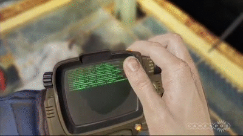

---
  
# ☢️RobCo Terminal Simulator    

A browser-based Linux terminal simulator inspired by the **Fallout universe**, streaming real Docker-based Linux environments into the browser through a retro-futuristic Pip-Boy interface.

This project combines **real containerized Linux systems** with a **fictional computing aesthetic**, blending practical infrastructure with immersive design.

 
---


## Lore & Inspiration

This project draws inspiration from the Fallout universe, a timeline where the transistor was never invented.

Instead of miniaturization and silicon, humanity mastered **atomic power**, leading to a technological world dominated by:

* Vacuum tubes
* Large, power-hungry machines
* Monochrome displays
* Text-based interfaces
* Centralized computing systems

In this universe, **RobCo Industries** emerged as a dominant force in computing and robotics. Their terminals, often referred to as *Pip-Boy* or *RobCo terminals*, reflect a 1950s vision of the future: utilitarian, industrial, and text-driven.

This project simulates such a terminal, not as a static UI, but as a **living system** backed by real Linux containers.

---
## How to set up this project?
1. Docker is really necessary for this project , it will spin up your containers which will host your Linux OS
2. Install and open docker
3. git clone this repository
4. go to frontend and change the websocket link with ur localhost
5. in both the frontend and backend do npm install and node will install the necessary packages to run your project
6. click on start-pipboy.bat to automatically start the backend and frontend if you are on a windows machine.

OR

7. You can individually start frontend and backend using node.

## What This Project Is

* A **real Linux environment** running inside Docker containers
* Streamed into the browser via WebSockets
* Rendered using a **custom Pip-Boy inspired terminal UI**
* Fully interactive (stdin/stdout)
* Ephemeral and sandboxed by design

Each browser session spins up a fresh Linux container, which is destroyed when the session ends.

---

## What This Project Is Not

* Not a virtual machine
* Not an emulator
* Not a fake terminal
* Not a game engine (yet)

This is **process-level Linux**, not virtualization.

---

## Architecture Overview

```
Browser (xterm.js)
   ↓ WebSocket
Backend (Node.js)
   ↓ Docker API
Linux Container (Ubuntu / Custom RobCo Image)
```

The browser acts as a display and input device.
The backend brokers input/output and lifecycle.
Docker provides isolation and reproducibility.

---

## Repository Structure

```
web-terminal/
├── pip-boy-frontend/     # UI, terminal rendering, sounds, aesthetics
├── pip-boy-backend/      # WebSocket server, Docker orchestration
├── start-pipboy.bat      # One-click Windows launcher
└── .gitignore
```

---

# 🖥️ pip-boy-frontend

The frontend is responsible for **presentation, immersion, and interaction**.

### Responsibilities

* Render terminal output using xterm.js
* Apply Pip-Boy inspired visuals (CRT glow, scanlines, green phosphor)
* Play keystroke, boot, and error sounds
* Handle user input and forward raw keystrokes to the backend
* Display boot sequences and shutdown animations

### Key Technologies

* HTML / CSS / JavaScript
* xterm.js
* WebSockets
* Browser Audio API

### Notes

* The frontend **does not run Linux**
* It only streams text and input
* All computation happens server-side

---

# 🔧 pip-boy-backend

The backend is the **engine room** of the project.

### Responsibilities

* Accept WebSocket connections
* Create and manage Docker containers per session
* Attach stdin/stdout streams to containers
* Enforce sandboxing and resource limits
* Destroy containers on disconnect

### Key Technologies

* Node.js (ES Modules)
* `ws` (WebSocket server)
* Docker
* dockerode

### Container Behavior

* Each session gets a fresh container
* Containers are short-lived and disposable
* No persistence unless explicitly added
* Designed to be safe to break

---

## Custom RobCo Linux Images (Planned / In Progress)

Instead of exposing a full Linux system, the project aims to ship **custom RobCo images** that:

* Remove `sudo`, `apt`, editors, and escape routes
* Use a controlled command set
* Replace bash with a RobCo-style shell
* Feel more like firmware than a general OS

The goal is not realism, but **believability**.

---

## Utility & Use Cases

Despite the aesthetic, this system is practically useful:

* Learning Linux safely
* Teaching shell concepts without setup friction
* Disposable command sandboxes
* Remote Linux environments on weak devices
* Experimentation without local risk

The Pip-Boy UI increases engagement, but the underlying system is serious infrastructure.

---

## Running the Project (Windows)

1. Ensure Docker Desktop is running (WSL2 backend enabled)
2. Install Node.js
3. From the project root, double-click:

```
start-pipboy.bat
```

This launches:

* Backend WebSocket server
* Frontend static server

Open:

```
http://localhost:3000
```

---

## Project Philosophy

This project treats Linux not as an operating system, but as an **engine**.

The user does not “use Linux”.
They interact with a **fictional operating system personality** built on top of it.

> A believable illusion is more powerful than full realism.

---

## Future Directions

* Custom RobCo firmware images
* Mission-based learning terminals
* Persistent vault terminals
* Multiple terminal personalities
* Cloud deployment
* Classroom / multi-user mode

---

## License

This project is experimental and educational.
Any Fallout-inspired elements are used as **homage**, not replication.

---


Just say the direction.
